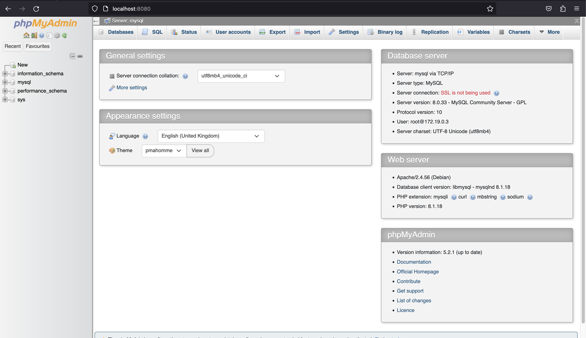
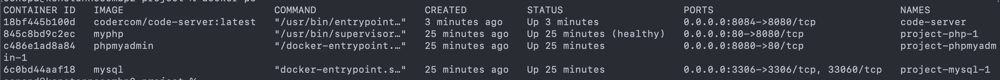
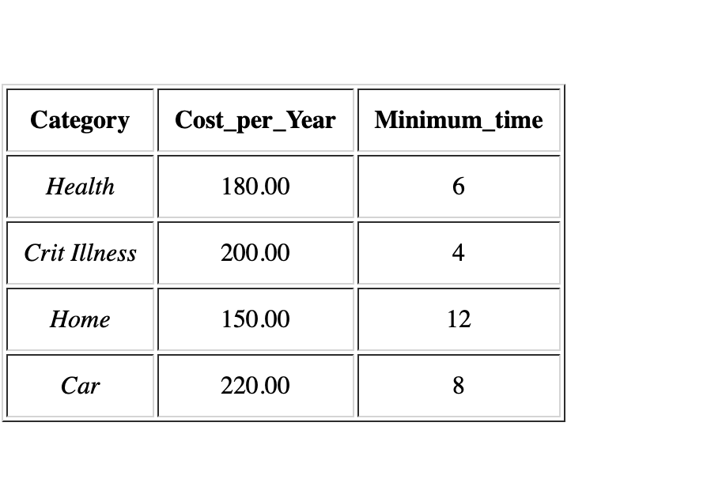
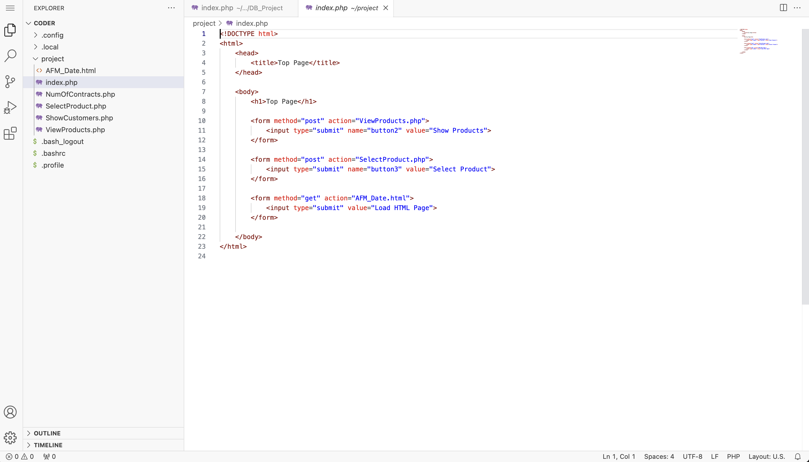
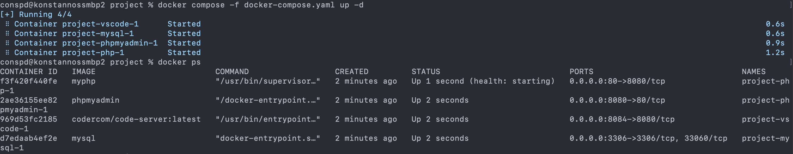
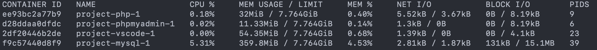
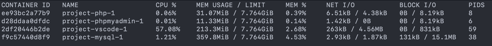
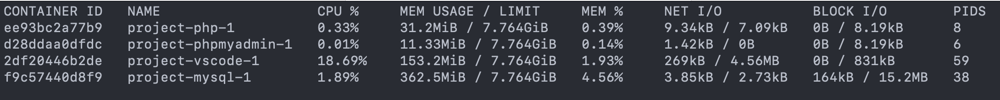
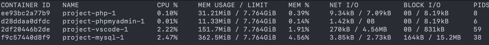
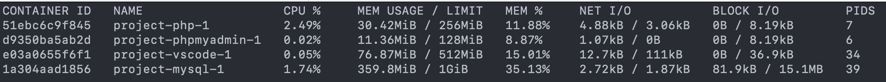

= Υπολογιστική Νέφους & Υπηρεσίες
:toc:
:toc-title: Περιεχόμενα

== *Εργασία Εργαστηρίου*
====
*Ονοματεπώνυμο:* Σπανουδάκης Κωνσταντίνος 

*Email:* cse46787@uniwa.gr

*Θέμα:* Containerized Web App με χρήση *PhP* - *Nginx* - *MySql* - *phpMyAdmin* και *VSCode*
====

Στην παρούσα εργασία παρουσιάζεται μια απλή Web App εφαρμογή που παρουσιάζει μια html σελίδα βασισμένη πάνω σε *php* η οποία χρησιμοποιώντας έναν ενσωματομένο *nginx* server δέχεται request και επικοινωνεί με βάση δεδομένων *MySql*, δίνεται πρόσβαση στην βάση με χρήση *phpMyAdmin*. Τέλος τρέχει ένα container *VSCode* το οποίο δίνει την δυνατότητα μέσω browser να μπορούμε να επεξεργαστούμε τα αρχεία του κώδικα.

Όπως είπαμε και στο θέμα τα παραπάνω 4 _(εκτός του nginx που είναι ενσωματωμένο στο php)_ είναι σε containerized μορφή όπου όσον αφορά το php δημιουργούμε εμείς ένα Image με `DockerFile`.

== *Setup*
====
Για να τρέξει η εφαρμογή εκτελούμε
[source, bash]
----
git clone https://github.com/ConSpd/dockerized-php-mysql-phpmyadmin-nginx-vscode.git
cd dockerized-php-mysql-phpmyadmin-nginx-vscode
./INSTALL.sh
----
====

=== Προαπαιτούμενα
Απαιτείται η ύπαρξη Docker και Docker Compose στον υπολογιστή που θα τρέξει

== *Με χρήση `Run`*
Εφόσων θέλουμε Web App το οποίο θα επικοινωνεί με βάση δεδομένων θα χρειαστούμε ένα κοινό δίκτυο το οποίο θα το δημιουργήσουμε με την εντολή:
[source, shell]
----
docker network create appNetwork
----

=== MySQL
Έπειτα για να δημιουργήσουμε το MySql container θα τρέξουμε το παρακάτω:
[source, shell]
----
docker run -d \
    -p 3306:3306 \
    -e MYSQL_ROOT_PASSWORD=password \
    -v db:/var/lib/mysql \
    -v "$(pwd)"/src/Database:/docker-entrypoint-initdb.d/your.sql \
    -m 1g \
    --network appNetwork \
    --name mysql \
    mysql
----
Στο παραπάνω ορίζουμε:

- `-p 3306:3306`: Το container θα τρέχει στο port 3306 του Host και 3306 του Container.
- `-e MYSQL_ROOT_PASSWORD=password`: Ο κωδικός που περνάμε σαν Environment Variable για τον MySQL Server.
- `-v db:/var/lib/mysql`: To volume που κάνουμε mount δημιουργείται εκείνη την στιγμή `db` και απεικονίζεται στον φάκελο `var/lib/mysql` του container όπου εκεί είναι by default ο χώρος αποθήκευσης για την mysql.
- `-v "$(pwd)":/dock...`: Κάνουμε import μια sql βάση που έχουμε αποθηκεύμενη στον Host υπολογιστή στον χώρο του container ώστε να χρησιμοποιηθεί.
- `'-m 1g`: Είναι η μέγιστη μνήμη που μπορεί να χρησιμοποιήσει το Container
- `--network appNetwork`: Το Network που θα χρησιμοποιήσουμε για να συνδέσουμε όλα τα container μαζί.
- `--name mysql`: To όνομα του Container.
- `mysql`: Το όνομα του Image.

==== Εισαγωγή Βάσης
Θα εισάγουμε μια ήδη υπάρχουσα βάση στον container.

Πρώτα θα συνδεδούμε στον container 
[source, sql]
----
docker exec -it mysql-service bash
----

Έπειτα θα συνδεθούμε στην βάση και θα δημιουργήσουμε την βάση general_insurance και έπειτα θα την γεμίσουμε με τα περιεχόμενα της ήδη υπάρχουσας που προσθέσαμε στον container από τον host.
[source, sql]
----
mysql -u root -p$MYSQL_ROOT_PASSWORD -e "create database general_insurance;"
mysql -u root -p$MYSQL_ROOT_PASSWORD general_insurance < /docker-entrypoint-initdb.d/your.sql/general_insurance.sql
----

=== PhpMyAdmin
[source, shell]
----
docker run -d \
    -p 8080:80 \
    -e PMA_HOST=mysql \
    -e PMA_USER=root \
    -e PMA_PASSWORD=password \
    -m 128m \
    --network appNetwork \
    --name phpmyadmin \
    phpmyadmin
----
Στο παραπάνω ορίζουμε

- `-p 8080:80`: Πόρτα 8080 για τον Host και 80 για τον Container.
- `-e PMA_HOST=mysql`: Όνομα του MySQL Host.
- `-e PMA_USER=root`: Username.
- `-e PMA_PASSWORD=password`: Κωδικός σύνδεσης.
- `'-m 128m`: Είναι η μέγιστη μνήμη που μπορεί να χρησιμοποιήσει το Container
- `--network appNetwork`: Network στο οποίο δημιουργήσαμε πριν τον MySQL.
- `--name phpmyadmin`: Όνομα του container
- `phpmyadmin`: Image που χρησιμοποιείται

.phpMyAdmin running at localhost:8080

=== php app
Χρησιμοποιούμε ένα php image το οποίο περιέχει ενσωμετωμένο έναν `nginx` server. θα δημιουργήσουμε ένα από Dockerfile που θα κάνει copy το source folder της εφαρμογής στο WORKDIR του container. Έπειτα θα κάνουμε build το image και θα τρέξουμε το container.

[source, shell]
----
docker build -t myphp .

docker run -d \
    -p 80:8080 \
    --network appNetwork \
    -v "$(pwd)"/src/DB_Project:/var/www/html \
    -m 256m \
    --name php \
    myphp
----

- `-p 80:8080`: Πόρτα 80 για τον Host και 8080 για τον Container.
- `--network appNetwork`: Network στο οποίο δημιουργήσαμε πριν το MySQL, και το phpMyAdmin.
- `m 128m`: Η μέγιστη μνήμη που μπορεί να χρησιμοποιήσει το Container.
- `-v "$(pwd)"/src/DB_Project:/var/www/html`: Κάνουμε copy τον src φάκελο που περιέχει τον κώδικα στο `/var/www/html` του container.
- `--name myphp-run`: Του δίνουμε όνομα
- `myphp`: Το Image.

=== VSCode
Δημιουργούμε ένα config file στο οποίο ορίζουμε ότι δεν θέλουμε το service να ζητάει authentication.

[source, shell]
----
mkdir -p .config/codeserver
echo "auth: none" >> .config/codeserver/config.yaml
----

Τρέχουμε το VSCode container με την παρακάτω εντολή.

[source, shell]
----
docker run -d \
    -p 8084:8080 \
    -v $(pwd)/.config:/home/coder/.config \
    -v $(pwd)/src/DB_Project:/home/coder/project \
    -m 512m \
    --name code-server \
    --network appNetwork \
    codercom/code-server:latest
----
To συγκεκριμένο Service ζητά το config που αποθηκεύσαμε παραπάνω όπου ορίσαμε να μην ζητάει κωδικό και το Project στο οποίο δουλεύουμε το οποίο μπαίνει σαν δεύτερο volume στο πρόγραμμα.

=== Τελική Παρουσίαση
Όταν τρέχουν και οι 3 containers τότε μπορούμε να μπούμε στο localhost και να εμφανιστεί η παρακάτω απλοϊκή σελίδα.

.Containers Runnning

.Front Page

.Show Products

Τώρα μπαίνουμε στο localhost:8084 και βλέπουμε την διεπαφή VSCode που δημιουργήσαμε προηγουμένως, οποιαδήποτε αλλαγή στον κώδικα αλλάζει και την σελίδα που τρέχει.

.VSCode Running

== *Με χρήση ``Compose``*

=== MySQL

[source, shell]
----
mysql:
  image: mysql
  restart: always
  mem_limit: 1g
  environment:
    - MYSQL_ROOT_PASSWORD=password
  ports:
    - 3306:3306
  volumes:
    - db:/var/lib/mysql
    - ./src/Database:/docker-entrypoint-initdb.d/your.sql
  networks:
    - appNetwork
----

Ότι ορίσαμε και στο και στο `Run` to ορίζουμε και εδώ, δηλαδή image, environment variables, ports, volumes, network _(το οποίο μπορεί να παραληφθεί)_ και βάζουμε να γίνεται ένα συνεχές restart μέχρις ότου εγκαθιδρυθεί η σύνδεση.

=== phpMyAdmin

[source, shell]
----
phpmyadmin:
    image: phpmyadmin
    restart: always
    mem_limit: 128m
    depends_on:
      mysql:
        condition: service_started
    environment:
      - PMA_HOST=mysql
      - PMA_USER=root
      - PMA_PASSWORD=password
    ports:
      - 8080:80
    networks:
      - appNetwork
----

=== php app

[source, shell]
----
php:
  image: myphp
  mem_limit: 256m
  depends_on:
    mysql:
      condition: service_started
    phpmyadmin:
      condition: service_started
  restart: always
  ports:
    - 80:8080
  volumes:
    - ./src/DB_Project:/var/www/html
  networks:
    - appNetwork
----
Πάλι ορίζουμε `depends_on` για το service `mysql` και το `phpmyadmin`, επίσης περνάμε volume τον Source κώδικα που υπάρχουν τα html και php αρχεία.

=== VSCode
[source, shell]
----
vscode:
  image: codercom/code-server:latest
  mem_limit: 512m
  ports:
    - 8084:8080
  volumes:
    - ./src/DB_Project:/home/coder/project
    - ./.config:/home/coder/.config
  environment:
    - PUID=1000
    - PGID=1000
  networks:
    - appNetwork
----
Όπως και στο RUN μεταφέρουμε τις εντολές σε μορφή compose.

=== Volumes & Networks
Τέλος θα ορίσουμε τα volumes και networks που χρησιμοποιήσαμε παραπάνω.

[source, shell]
----
volumes:
  db:

networks:
  appNetwork:
    driver: bridge
----

=== Τρέξιμο του compose
Η εντολή να τρέξει το Docker Compose είναι απλή, πηγαίνουμε στον φάκελο που περιέχει το `docker-compose.yml` αρχείο και τρέχουμε.

[source, shell]
----
docker compose -f docker-compose.yaml up -d
----

Και βλέπουμε ότι και τα 3 services τρέχουν κανονικά 

.Compose Running Services

Πηγαίνουμε στο localhost:80 και βλέπουμε ότι η σελίδα έχει ξεκινήσει. 

.Running App

Για να το κλείσουμε τρέχουμε

[source, shell]
----
docker compose down
----

== *Out of Memory Exception*
Για να βρούμε το τι χρησιμοποιεί το κάθε container θα τρέξουμε το compose αρχείο και με την εντολή `docker stats` θα δούμε το κόστος σε πόρους.

.Running Containers

Από ότι βλέπουμε με πλήρη λειτουργικότητα της εφαρμογής:

- Η MySQL καταναλώνει γύρω στα 300-400MB
- Το VSCode καταναλώνει γύρω στα 50-150MB
- Το phpApp καταναλώνει γύρω στα 30-40MB
- Το phpMyAdmin καταναλώνει γύρω στα 10-12MB

Θα αναθέσουμε όρια λίγο παραπάνω από αυτά που βλέπουμε στην μέτρηση.

- MySQL: 1GB
- VSCode: 512MB
- phpApp: 256MB
- phpMyAdmin: 128MB

Αυτά είναι τα νούμερα που χρησιμοποιήσαμε παραπάνω στις Run και Compose εντολές.

.Running Containers after Limits

Στην παραπάνω εικόνα βλέπουμε στην στήλη `LIMIT` τα όρια που θέσαμε για κάθε υπηρεσία να έχει οριστεί.